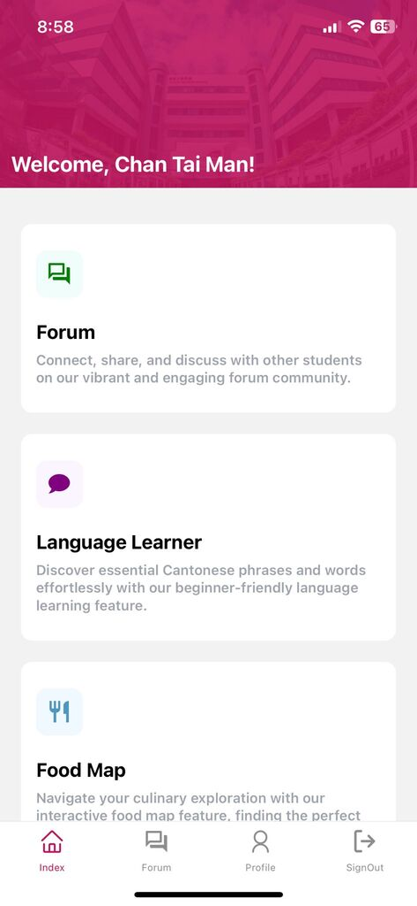
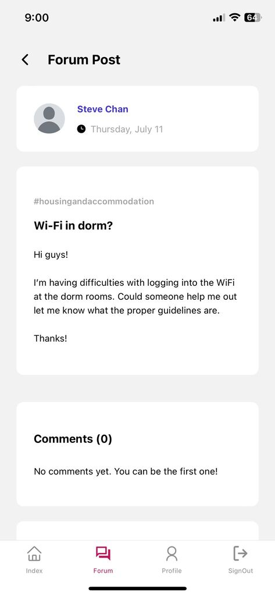
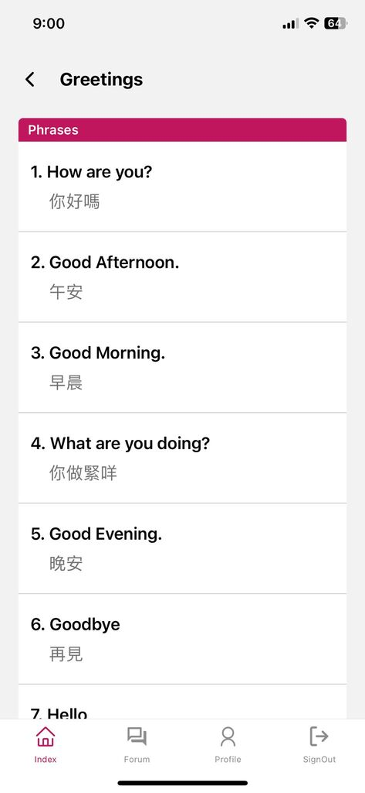

# CityUConnect

CityUConnect is an innovative mobile application developed as a Final Year Project at City University of Hong Kong. The app aims to enhance the university experience for international students by providing a comprehensive platform that addresses common challenges and facilitates community building.

<div>

[](https://reactnative.dev/)
[](https://expo.dev/)
[](https://tailwindcss.com/)
[](https://firebase.google.com/)

</div>

## App Screenshots

<p align="center">
  
  
  
</p>

## Key Features

#### 🔐 User Authentication & Profiles
- Secure login and registration system
- Customizable student profiles
- Account management for easy updates

#### 💬 Interactive Forum
- Designed for students to connect, share, and discuss with peers
- Create new posts, view existing posts, and leave comments
- Share experiences and advice, fostering a supportive community

#### 🗣️ Cantonese Language Learning
- Learn commonly used Cantonese phrases with Jyutping (Cantonese Pinyin) highlighting
- Practice by listening and repeating phrases

#### 🍜 Food Map
- Find the nearest restaurants based on your preferences
- Interactive map displaying restaurants tailored to your choices
- Get real-time directions to selected restaurants

## Getting Started

### Prerequisites
- Node.js (v14 or higher)
- npm or yarn
- Expo CLI
- iOS/Android device or emulator

### Installation

1. Clone the repository:
   ```sh
   git clone https://github.com/ssafwann/CityUConnect.git
   cd CityUConnect
   ```

2. Install dependencies:
   ```sh
   npm install
   ```

3. Start the development server:
   ```sh
   npx expo start
   ```

4. Run the app:
   - 📱 Scan the QR code using [Expo Go](https://expo.dev/client) app
   - 🖥️ Press 'i' for iOS simulator
   - 🤖 Press 'a' for Android emulator

## Tech Stack

- **Frontend Framework**: React Native
- **Development Platform**: Expo
- **Styling**: TailwindCSS
- **Navigation**: React Navigation
- **State Management**: React Context API
- **Backend Services**: Firebase
  - **Authentication**: User authentication and management using Firebase Auth
  - **Database**: Firestore for real-time data storage and retrieval
  - **Storage**: Firebase Storage for storing and serving user-generated content (e.g., audio phrases)

## Contact

For any questions, please contact me on my email: <a href="mailto:safwan917@gmail.com">safwan917@gmail.com</a>

---
